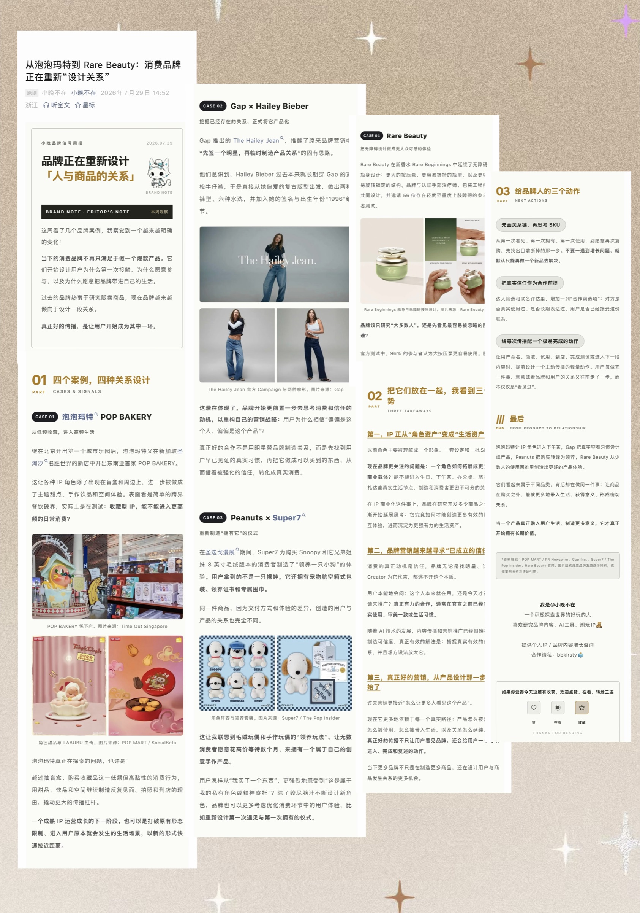

# @小晚不在 · 公众号排版 Lite

仓库地址：https://github.com/cyberxiaowan/xiaowan-wechat-layout-skill

这是 @小晚不在 在实际制作公众号长文时，基于多年内容工作、多轮截图反馈、手机端修改和真实发布复盘沉淀出的公开 Skill。

它建立在甲木 × 摸鱼小李制作的
[gzh-design](https://github.com/isjiamu/gzh-design-skill) 之上：底层负责生成公众号兼容 HTML，本项目继续增加**内容逻辑诊断、个人审美共创、移动端调整与发布复盘**。

## 它真正提供什么

### 1. 内容逻辑诊断

排版前先帮助作者看清：

- 文章写给谁，为什么值得继续看；
- 全文真正想让读者记住什么；
- 每个章节分别承担什么职责；
- 哪些内容重复，哪些判断缺少证据；
- 结尾应该完成理解、行动还是情绪收束。

它不会默认把所有文章套成品牌案例文，也不会未经允许直接重写全文。

### 2. 审美共创

它会结合用户自己的已发布文章、参考图、品牌资产和反馈，把“看起来不舒服”翻译成可执行的视觉判断：

- 层级是否清楚；
- 每屏信息是否过密；
- 文字、图片和重点句的节奏是否舒适；
- 横线、竖线、色块和外框是否过多；
- 标题是否出现 2～3 字孤行；
- 重点是否只高亮了半句；
- 图片是否真的解释了正文；
- 哪些调整值得写进自己的个人风格卡。

目标不是复制 @小晚不在，而是帮助每个人逐渐形成自己的公众号审美与排版规则。

### 3. 排版与发布执行

- 调用 `gzh-design` 生成公众号 HTML；
- 生成干净正文、带复制按钮的预览版和发布稳定版；
- 多图进入公众号前预先拼好；
- 检查约 390px 手机宽度；
- 粘贴到公众号后台检查丢图、乱码、错位和断行；
- 把最终人工调整区分为单篇特例或长期偏好。

## 实际案例

[](https://mp.weixin.qq.com/s/EKjNjihmkXBYgao16m5ztQ?scene=1)

[查看完整公众号文章](https://mp.weixin.qq.com/s/EKjNjihmkXBYgao16m5ztQ?scene=1)

这张长图是 @小晚不在 使用底层排版能力，再经过多轮人工判断和修改得到的**共创案例**，用于展示“如何从反馈中建立自己的规则”，不是安装后的默认模板。Skill 不会自动复制其中的 AI呀、署名、配色和完整版式。

示意图仅用于展示排版效果；文章中的品牌图片版权归原品牌及原媒体所有。

## 安装

### 方式一：一条提示词安装或更新两个 Skill

把下面整段复制给 Codex：

```text
请帮我安装并验证以下两个 Codex Skill：

1. gzh-design
   https://github.com/isjiamu/gzh-design-skill

2. xiaowan-wechat-layout-lite
   https://github.com/cyberxiaowan/xiaowan-wechat-layout-skill

要求：
- 先检查本机已安装的 Skills；
- 缺少哪个就从对应 GitHub 仓库安装；
- 如果 xiaowan-wechat-layout-lite 已存在，先备份旧目录，再用仓库最新版更新；
- gzh-design 已存在时不要覆盖用户自定义主题；只确认它结构完整、可以被调用；
- 安装到 Codex 的 Skills 目录；
- 检查两个目录都包含有效的 SKILL.md；
- 告诉我安装或更新结果，以及新开 Codex 任务后如何调用。
```

### 方式二：Mac 一键安装

下载并解压仓库后，双击 `install.command`。它会更新公开 Skill；若本机缺少 `gzh-design`，会自动安装底层依赖。

安装完成后，新开一个 Codex 任务即可使用。

## 三种调用方式

### 完整共创：先理逻辑，再定审美，最后排版

```text
用 $xiaowan-wechat-layout-lite 处理这篇公众号文章。
先诊断内容逻辑，不要直接重写；再结合我的参考图和历史文章，
整理一张个人风格卡。等我确认后，再生成可复制的公众号 HTML。
```

### 正文已定稿：只排版

```text
用 $xiaowan-wechat-layout-lite 排版这篇公众号文章。
正文已经定稿，不要改文字。根据我的参考和个人风格卡完成手机端排版，
再生成可复制的 HTML，并检查 390px 预览和公众号粘贴稳定性。
```

### 已有 HTML：只做审美与发布检查

```text
用 $xiaowan-wechat-layout-lite 检查这份公众号 HTML。
先判断问题属于内容层级、阅读节奏、装饰、强调、图片还是平台兼容，
只修改对应层，不要重做已确认的部分。
```

## 默认视觉起点

用户尚未形成个人风格时，可以暂时从以下参数开始：

- 正文：`14px / #595757 / 1.9–2` 行距；
- 章节强调：赭金 `#b17816`；
- 背景：米白 `#fdfdf8`；
- 少线条、少外框，优先靠层级与留白组织文章；
- 重点覆盖完整语义；
- 图片预合成后再粘贴；
- 最终以公众号后台和手机预览为准。

这些只是第一版起点。用户提供自己的发布稿、参考图、品牌规范或明确反馈后，应形成并优先使用用户自己的风格卡。

## 边界

- 它可以诊断内容逻辑，但不会替作者决定观点；
- 它可以在授权后调整结构或文字，但不会默认重写正文；
- 它可以分析参考图的层级、密度和节奏，但不会复制他人的 IP 与完整版式；
- 它不会把品牌案例、教程、访谈和个人复盘强行排成同一种文章；
- 它不包含 `gzh-design` 源码，也不包含 @小晚不在 的私人文章、AI呀素材或业务资料。

## 授权与致谢

- 排版底层：甲木 × 摸鱼小李的 `gzh-design`；
- 内容逻辑、审美共创与移动端工作流：@小晚不在；
- 本项目采用 `AGPL-3.0-or-later`；
- 使用者应替换为自己的合法图片、IP、署名和内容资产。

详见 [NOTICE.md](NOTICE.md)。
